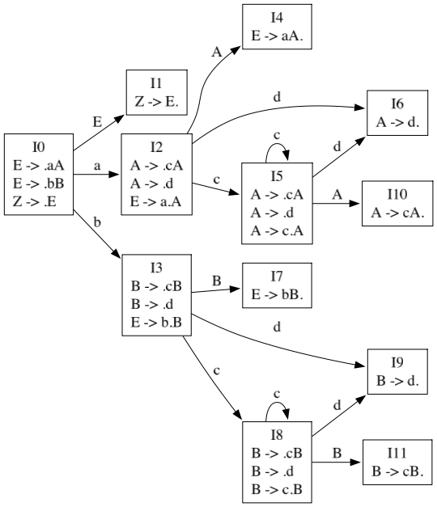

# go\-compiler\-lab

编译原理课程实验

 


## 实验结构


- **lab1/**：NFA 转换 DFA 
- **lab2/**：DFA 最小化
- **lab3/**：LL(1) 文法判断
- **lab4/**：LL(1) 文法改写和语法分析
## 实验1

### 功能说明

1. 读取 NFA 配置文件，解析状态、输入符号及转移关系

2. 通过子集构造法，将 NFA 转换为 DFA

3. 支持 DFA 可视化，生成清晰的状态图

4. 支持命令行参数，可指定输入路径

### 实验1 目录结构

```plain text
lab1/
├── main.go                # 程序入口（主函数）
├── input/                 # 输入文件目录
├── internal/              # 内部模块
│   ├── dfa/          
│   │   ├── dfa.go         # DFA 数据定义
│   │   └── subset.go      # 子集法
│   ├── nfa/
│   │   ├── nfa.go         # NFA 数据定义
│   │   └── transition.go  # eplison-closure 方法和 move 方法
│   └── render/
│       └── draw.go        # Graphviz绘图
└── output/                # 生成文件输出目录
```

## 前置要求

- Go 1\.26 

- Graphviz（用于 DFA 可视化）

- 所需 Go 依赖包：
        

    - github\.com/goccy/go\-graphviz（绘图相关）

    - github\.com/deckarep/golang\-set/v2（集合操作）

## 使用方法

### 1\. 安装依赖

```bash
go mod tidy
```

### 2\. 运行实验1

```bash

# 进入 lab1 目录运行
cd lab1
go run main.go -input input/nfa.txt 
```

### 3\. 命令行参数说明

- `\-input`：指定 NFA 配置文件路径（默认：input/nfa\.txt）

## NFA 输入文件格式（nfa\.txt）

配置文件按以下格式编写，每行对应一个配置项：

```plain text
状态（逗号分隔）
输入符号（逗号分隔）
起始状态
终止状态
转移关系（每行一个，格式：当前状态,输入符号=目标状态）
```

### 示例 nfa\.txt

```plain text
0,1,2
a,b
0
2
0,a=0,1
0,b=0
1,a=2
1,b=2
2,a=2
2,b=2
```
## 运行结果
**NFA**


**DFA**


## 实验2

### 功能说明

1. 读取 DFA 配置文件，解析状态、输入符号及转移关系

2. 通过划分法，将 DFA 最小化

3. 支持 DFA 可视化，生成清晰的状态图

### 实验2 目录结构

```plain text
lab2/
├── main.go                # 程序入口（主函数）
├── input/                 # 输入文件目录
├── internal/              # 内部模块
│   ├── dfa/
│   │   ├── dfa.go         # DFA 数据定义
│   │   ├── minimize.go    # 最小化
│   │   └── subset.go      # 子集法
│   ├── nfa/
│   │   ├── nfa.go         # NFA 数据定义
│   │   └── transition.go  # eplison-closure 方法和 move 方法
│   └── render/
│       └── draw.go        # Graphviz绘图
└── output/                # 生成文件输出目录
```

### 运行实验2

```bash
# 进入 lab2 目录运行
cd lab2
go run main.go
```

## DFA 输入文件格式（dfa\.txt）

配置文件按以下格式编写，每行对应一个配置项：

```plain text
状态（逗号分隔）
输入符号（逗号分隔）
起始状态
终止状态（逗号分隔）
转移关系（每行一个，格式：当前状态,输入符号=目标状态）
```

### 示例 dfa\.txt

```plain text
1,2,3,4,5,6,7
a,b
1
5,6,7
1,a=6
1,b=3
2,a=7
2,b=3
3,a=1
3,b=5
4,a=4
4,b=6
5,a=7
5,b=3
6,a=4
6,b=1
7,a=4
7,b=2
```
## 运行结果

**原 DFA**


**最小化 DFA**


## 实验3

### 功能说明

1. 读取文法文件，解析非终结符、终结符及产生式
2. 计算 FIRST、FOLLOW 和 SELECT 集合，判断是否为 LL1 文法


### 实验3 目录结构

```plain text
lab3/
├── cmd/
│   └── main.go            # 程序入口
├── input/                 # 文法输入文件目录
└── internal/
    └── grammar/
        └── grammar.go     # 文法分析、LL1 判定及改写逻辑
```

### 运行实验3

```bash
# 进入 lab3 目录运行
cd lab3
go run ./cmd -input input/g1.txt
```

### 文法输入文件格式（g1.txt）

配置文件按以下格式编写：

```plain text
非终结符（逗号分隔）
终结符（逗号分隔）
产生式（每行一个，格式：A -> α）
```

- 空产生式使用 `ε` 表示
- 结束符默认使用 `#`

### 示例 g1.txt

```plain text
S, A, B, C, D
a, b, c
S -> AB
S -> bC
A -> ε
A -> b
B -> ε
B -> aD
C -> AD
C -> b
D -> aS
D -> c
```

## 实验4

### 功能说明

1. 读取文法文件,若不是 LL1 文法，尝试消除左递归和左公共因子，并删除不可达产生式
2. 构建 LL(1) 分析表
3. 使用 LL(1) 预测分析算法对输入串进行语法分析
4. 输出分析过程，包括分析栈、剩余输入串和推导所用产生式

### 实验4 目录结构

```plain text
lab4/
├── cmd/
│   └── main.go            # 程序入口
├── input/                 # 文法输入文件目录
└── internal/
    └── grammar/
        ├── grammar.go     # 文法分析、LL1 判定及改写逻辑
        └── parse.go       # LL(1) 预测分析过程
```

### 运行实验4

```bash
# 进入 lab4 目录运行
cd lab4
go run ./cmd -input input/g11.txt
```

### LL(1) 语法分析过程示例

以下为输入串 `i+i*i#` 的 LL(1) 预测分析过程：

步骤   | 分析栈          | 剩余输入串      | 推导所用产生式或匹配          
-------|-----------------|-----------------|----------------------
1      | \#E              | i+i*i#          | E->TZ               
2      | \#ZT             | i+i*i#          | T->FY               
3      | \#ZYF            | i+i*i#          | F->i                
4      | \#ZY             | +i*i#           | i匹配                 
5      | \#ZY             | +i*i#           | Y->ε                
6      | \#Z              | +i*i#           | Z->+TZ              
7      | \#ZT             | i*i#            | +匹配                 
8      | \#ZT             | i*i#            | T->FY               
9      | \#ZYF            | i*i#            | F->i                
10     | \#ZY             | *i#             | i匹配                 
11     | \#ZY             | *i#             | Y->\*FY              
12     | \#ZYF            | i#              | *匹配                 
13     | \#ZYF            | i#              | F->i                
14     | \#ZY             | #               | i匹配                 
15     | \#ZY             | #               | Y->ε                
16     | \#Z              | #               | Z->ε                
17     | \#               | #               | 接受       

## 实验5

### 功能说明

1. 加载文法并拓广开始符号
2. 构造 LR(0) 项目集并生成项目集族
3. 构建 LR(0) 分析表，包括 `ACTION` 和 `GOTO`
4. 打印 LR(0) 分析表，并逐步输出分析过程
5. 支持用户指定输入串进行分析
6. 生成项目集 DFA 可视化图像

### 实验5 目录结构

```plain text
lab5/
├── cmd/
│   └── main.go            # 程序入口
├── input/                 # 文法输入文件目录
└── internal/
    └── grammar/
        ├── grammar.go     # 文法读取与数据结构
        └── parser.go      # LR(0) 项目集、分析表与分析过程实现
```

### 运行实验5

```bash
cd lab5
go run ./cmd -inputGrammar input/g1.txt -inputString bccd
```

### 参数说明

- `-inputGrammar`：指定文法文件路径，默认 `input/g1.txt`
- `-inputString`：指定要分析的输入串，默认 `bccd`

### 文法输入文件格式（g1.txt）

配置文件按以下格式编写：

```plain text
非终结符（逗号分隔）
终结符（逗号分隔）
产生式（每行一个，格式：A -> α）
```

### 示例 g1.txt

```plain text
E, A, B

a, b, c, d

E -> aA
E -> bB
A -> cA
A -> d
B -> cB
B -> d
```
```plain text
╭──────────────────────────────────────────────╮
│ LR(0)分析表                                   │
├──────┬─────────────────────────┬─────────────┤
│ 状态  │        ACTION           │     GOTO    │
│      ├────┬────┬────┬────┬─────┼───┬────┬────┤
│      │ a  │ b  │ c  │ d  │ #   │ E │ A  │ B  │
├──────┼────┼────┼────┼────┼─────┼───┼────┼────┤
│   0  │ s2 │ s3 │    │    │     │ 1 │    │    │
│   1  │    │    │    │    │ ACC │   │    │    │
│   2  │    │    │ s5 │ s6 │     │   │ 4  │    │
│   3  │    │    │ s8 │ s9 │     │   │    │ 7  │
│   4  │ r1 │ r1 │ r1 │ r1 │ r1  │   │    │    │
│   5  │    │    │ s5 │ s6 │     │   │ 10 │    │
│   6  │ r4 │ r4 │ r4 │ r4 │ r4  │   │    │    │
│   7  │ r2 │ r2 │ r2 │ r2 │ r2  │   │    │    │
│   8  │    │    │ s8 │ s9 │     │   │    │ 11 │
│   9  │ r6 │ r6 │ r6 │ r6 │ r6  │   │    │    │
│  10  │ r3 │ r3 │ r3 │ r3 │ r3  │   │    │    │
│  11  │ r5 │ r5 │ r5 │ r5 │ r5  │   │    │    │
╰──────┴────┴────┴────┴────┴─────┴───┴────┴────╯
```
```plain text
╭─────────────────────────────────────────────────╮
│ 对输入串bcca的LR(0)分析过程                        │
├──────┬────────┬────────┬────────┬────────┬──────┤
│ 步骤 │ 状态栈 │ 符号栈 │ 输入串 │ ACTION │ GOTO │
├──────┼────────┼────────┼────────┼────────┼──────┤
│ (1)  │ 0      │ #      │  bcca# │ s3     │      │
│ (2)  │ 03     │ #b     │   cca# │ s8     │      │
│ (3)  │ 038    │ #bc    │    ca# │ s8     │      │
│ (4)  │ 0388   │ #bcc   │     a# │ ERR    │      │
╰──────┴────────┴────────┴────────┴────────┴──────╯
```


### 运行结果

- 打印拓广后的文法
- 打印所有 LR(0) 项
- 打印项目集族、`ACTION`/`GOTO` 分析表
- 逐行打印 LR(0) 语法分析过程
- 生成 `output/dfa.png` 项目集 DFA 可视化图

### 依赖说明

- `github.com/goccy/go-graphviz`：Graphviz 图像导出
- `github.com/jedib0t/go-pretty/v6/table`：表格美化输出


