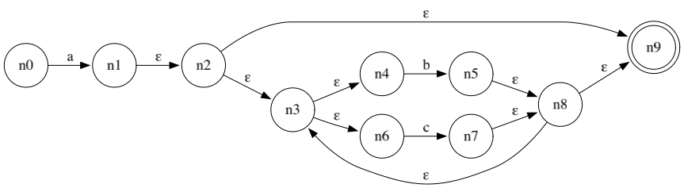
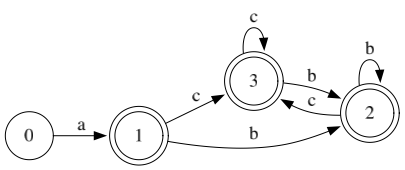
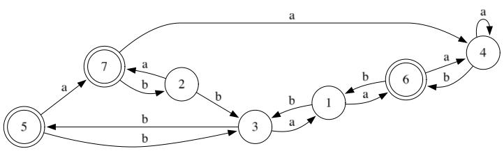
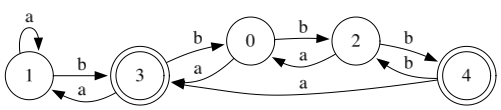

# go\-compiler\-lab

编译原理课程实验


## 实验结构


- **lab1/**：NFA 转换 DFA 
- **lab2/**：DFA 最小化

## 实验1

### 功能说明

1. 读取 NFA 配置文件，解析状态、输入符号及转移关系

2. 通过子集构造法，将 NFA 转换为 DFA

3. 支持 DFA 可视化，生成清晰的状态图

4. 支持命令行参数，可指定输入路径

### 实验1 目录结构

```plain text
lab1/
├── main.go          # 程序入口（主函数）
├── input/           # 输入文件目录
├── internal/        # 内部模块
│   ├── dfa/
│   │   ├── dfa.go
│   │   └── subset.go
│   ├── nfa/
│   │   ├── nfa.go
│   │   └── transition.go
│   └── render/
│       └── draw.go
└── output/          # 生成文件输出目录
```

## 前置要求

- Go 1\.26 

- Graphviz（用于 DFA 可视化）

- 所需 Go 依赖包：
        

    - github\.com/goccy/go\-graphviz（绘图相关）

    - github\.com/deckarep/golang\-set/v2（集合操作）

## 使用方法

### 1\. 安装依赖

```bash
go mod tidy
```

### 2\. 运行实验1

```bash

# 进入 lab1 目录运行
cd lab1
go run main.go -input input/nfa.txt 
```

### 3\. 命令行参数说明

- `\-input`：指定 NFA 配置文件路径（默认：input/nfa\.txt）

## NFA 输入文件格式（nfa\.txt）

配置文件按以下格式编写，每行对应一个配置项：

```plain text
状态（逗号分隔）
输入符号（逗号分隔）
起始状态
终止状态
转移关系（每行一个，格式：当前状态,输入符号=目标状态）
```

### 示例 nfa\.txt

```plain text
0,1,2
a,b
0
2
0,a=0,1
0,b=0
1,a=2
1,b=2
2,a=2
2,b=2
```
## 运行结果
**NFA**



**DFA**



## 实验2

### 功能说明

1. 读取 DFA 配置文件，解析状态、输入符号及转移关系

2. 通过划分法，将 DFA 最小化

3. 支持 DFA 可视化，生成清晰的状态图

### 实验2 目录结构

```plain text
lab2/
├── main.go          # 程序入口（主函数）
├── input/           # 输入文件目录
├── internal/        # 内部模块
│   ├── dfa/
│   │   ├── dfa.go
│   │   ├── minimize.go
│   │   └── subset.go
│   ├── nfa/
│   │   ├── nfa.go
│   │   └── transition.go
│   └── render/
│       └── draw.go
└── output/          # 生成文件输出目录
```

### 运行实验2

```bash
# 进入 lab2 目录运行
cd lab2
go run main.go
```

## DFA 输入文件格式（dfa\.txt）

配置文件按以下格式编写，每行对应一个配置项：

```plain text
状态（逗号分隔）
输入符号（逗号分隔）
起始状态
终止状态（逗号分隔）
转移关系（每行一个，格式：当前状态,输入符号=目标状态）
```

### 示例 dfa\.txt

```plain text
1,2,3,4,5,6,7
a,b
1
5,6,7
1,a=6
1,b=3
2,a=7
2,b=3
3,a=1
3,b=5
4,a=4
4,b=6
5,a=7
5,b=3
6,a=4
6,b=1
7,a=4
7,b=2
```
## 运行结果

**原 DFA**



**最小化 DFA**




